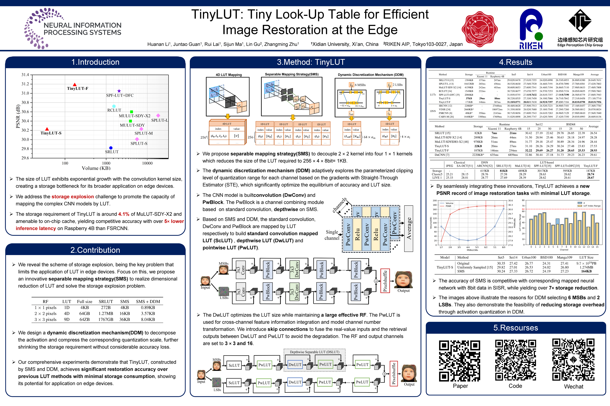

# TinyLUT: Tiny Look-Up Table for Efficient Image Restoration at the Edge (NeurIPS 2024)

[paper](https://openreview.net/pdf?id=tN0xnYPLt6)<br> 



## Environment
CUDA 11.1<br> 
CUDNN 8.5.0<br> 
torch 1.10<br> 
torchvision 0.8.0<br> 
opencv-python

## Dataset
### Train Dataset
[DVI2K](https://data.vision.ee.ethz.ch/cvl/DIV2K/)

### Test Dataset
Set5<br> 
Set14<br> 
Urban100<br> 
[BSD100](https://www2.eecs.berkeley.edu/Research/Projects/CS/vision/bsds/)<br> 
[Manga109](http://www.manga109.org/en/)

## Usage
### Transferring LUT network into LUTs
>python ./Transfer_TinyLUT.py

### Test LUTs
>python ./test_TinyLUT.py

## Acknowledgments
Thanks the ACs and the reviewers for their insightful comments, which are very helpful to improve our paper!<br>
This work is based on the following works, thank the authors a lot.<br>
[SRLUT](https://github.com/yhjo09/SR-LUT)<br> 
[MULUT](https://github.com/ddlee-cn/MuLUT/tree/main)

## Citation
>@inproceedings{
li2024tinylut,<br>
title={Tiny{LUT}: Tiny Look-Up Table for Efficient Image Restoration at the Edge},<br>
author={Huanan LI and Juntao Guan and Lai Rui and Sijun Ma and Lin Gu and Zhangming Zhu},<br>
booktitle={The Thirty-eighth Annual Conference on Neural Information Processing Systems},<br>
year={2024},<br>
url={https://openreview.net/forum?id=tN0xnYPLt6}}

```python
#!/usr/bin/env python3
print("Hello, World!");
```
